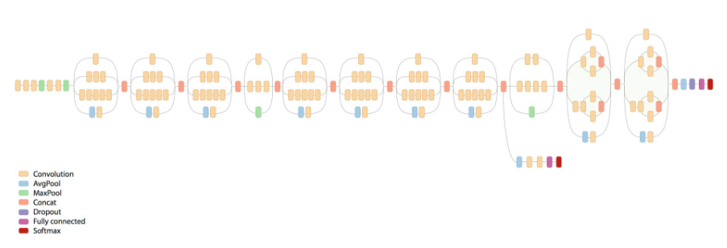

# Pretrained_network

Using Pretrained InceptionV3 network to predict employment labels of villages.

Model:

We used keras pretrained InceptionV3 network. We removed the top layer of network, added a fc layer with 1024 nodes
and an output layer with 3 nodes.

