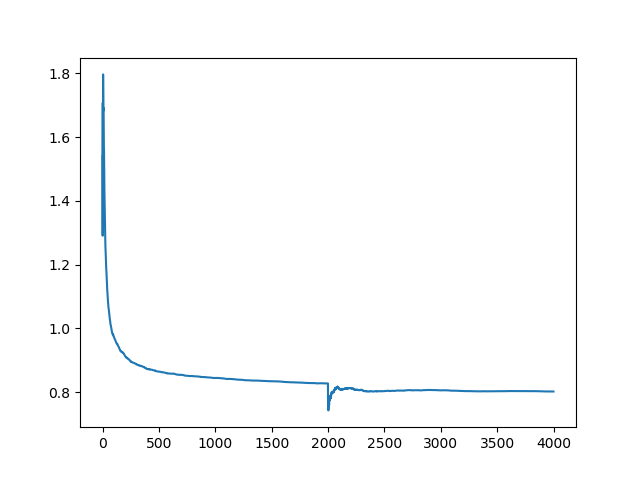
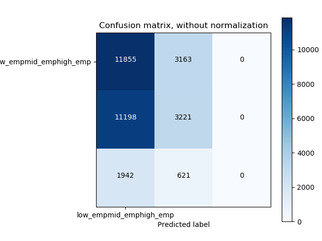
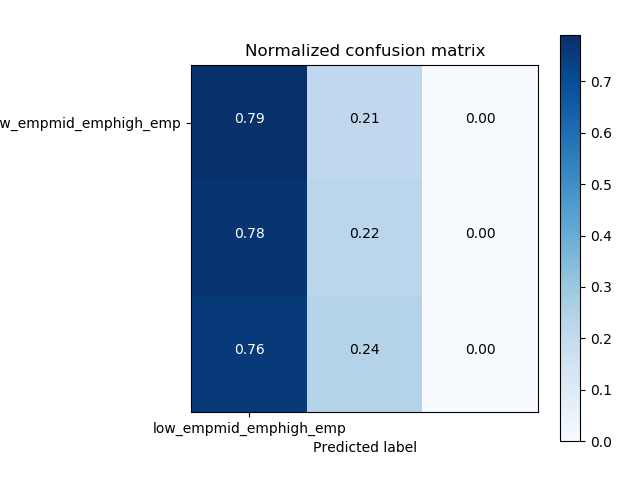

# Pretrained_network

Using Pretrained InceptionV3 network to predict employment labels of villages.

Model:

We used keras  InceptionV3 network which is pretrained on imagenet dataset. We removed the top layer of network, added a fc layer with 1024 nodes
and an output layer with 3 nodes.

Training:
In training, only the weight of FC layer is learned keeping weight of the remaining architecture fixed.
The network is trained for 2 epochs.

to train network:

nohup python inceptionnet_pretrained.py > Results/pretrained_out1.txt 2>&1 &

To plot training loss:

python plot_loss.py

To plot confusion matrix:

python plot_confusion_matrix.py

Results:

Unnormalized confusion matrix:

Normalized confusion matrix:

